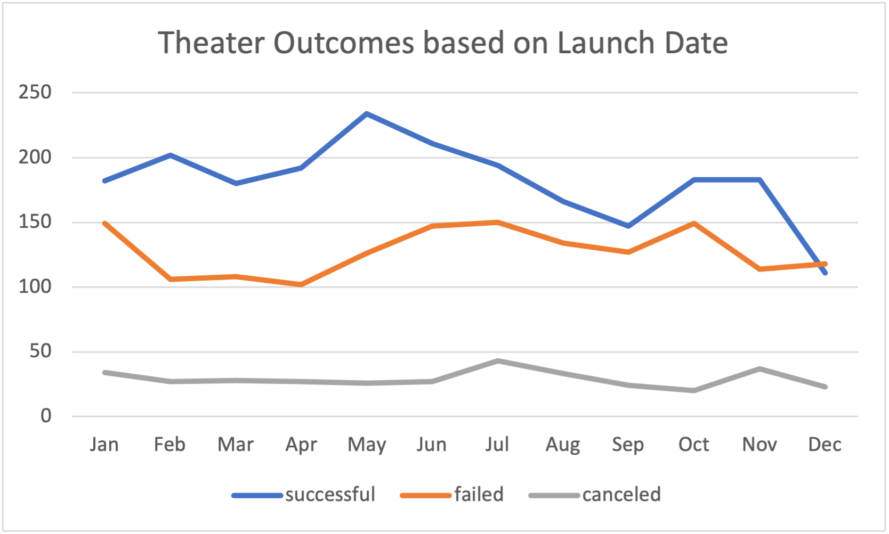
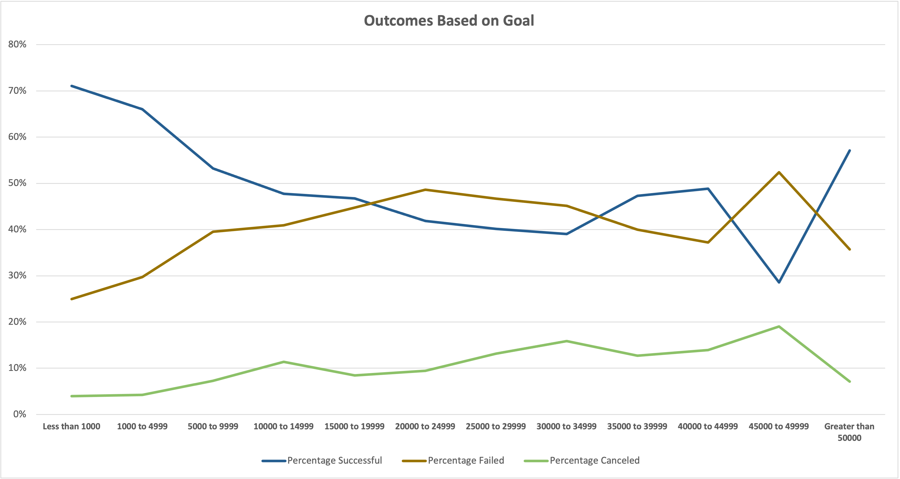

# Kickstarter-Analysis
Outcomes based on analysis of Kickstarter Data
## The Purpose of this Analysis:
The client wants to know how different campaigns fared in relation to their launch dates and their funding goals. By creating visuals of the campaign outcomes, we can analyze how they performed.
## Analysis
Using an excel functions and pivot tables I created visuals to show the client the relationship between the launch date and the success of the theater campaign. These visuals will allow us to make an analysis of the trends we see.
[Kickstarter Excel Sheet](Kickstarter_Challenge .xlsx.zip)
#### Theater Outcomes based on Launch Date 
1. Used the Year function to pull the year from the Launch Date column
  -`=YEAR()`
    - Returns the year corresponding to a date. The year is returned as an integer in the range 1900-9999 from cell specified.
2. Created a Pivot Table based on Kickstarter Data with the following: 

[Pivot Table Resource][https://support.microsoft.com/en-us/office/create-a-pivottable-to-analyze-worksheet-data-a9a84538-bfe9-40a9-a8e9-f99134456576]
3. Filtered:
  - Category based on Parent Category-Theater
  - Column labels to show successful, failed, and cancelled in descending order.
4. Created a Line Chart to visualize findings.
[Launch Date Chart](Resources/Theater_Outcomes_vs_Launch.png)
#### Theater Outcomes based on Goals 
Using excel functions I created a visual to show the client how many campaigns succeeded, failed, or were cancelled based on, if they were in a dollar certain range for their goal. This one required more excel function usage to calculate the values. 
Column references are from File: **ADD FILE FOR EXCEL FROM REP**

1. Calculations:
- Columns B:D
  -`=COUNTIFS()`
  - =COUNTIFS('REF SHEET'!$D:$D,">=RANGE",'REF SHEET'!$D:$D,"<=RANGE",'REF SHEET'!$F:$F,"OUTCOME")
[COUNTIF Resource][https://support.microsoft.com/en-us/office/countif-function-e0de10c6-f885-4e71-abb4-1f464816df34]
- Column D
  -`=SUM()`
  - =SUM(B:D) B+C+D
[Sum Resource][https://support.microsoft.com/en-us/office/sum-function-043e1c7d-7726-4e80-8f32-07b23e057f89]
- Columns F:G
  - % Success = ColumnB/ColumnE
  - % Failed = ColumnC/ColumnE
  - % Canceled = ColumnD/ColumnE
  Set these columns format to percentage with no decimals.
  
2. Created Line Chart Visual
    - Selected columns A(Goal) and F,G,H (Percentage Outcomes)
	  - Created line chart to display Outcomes Based on Goals
[Campaign Goals Chart](Resources/Outcomes_vs_Goals.png)

#### Challenges
Problem: Copying Countifs across multiple cells. I realized the `=COUNTIF()` was very particular to column A. I also did not know how to put in a range such as 2-4 vs just >2.
Solution: I watched a video on Countif and learned that I had to manually plug in more data for columns B:D and that the range issue would be solves by adding 2 different criteria. 

## Results
  **Outcomes based on Launch**
    The values are based on the count of each outcome. To find out where campaigns would get the most success, I looked for where the success line is the highest and the failure is the lowest. The distance between the line indicates whether there is a difference in the values of success vs failure. May has the highest percentage of success. May is also the highest failure month, but there are much more successes than failures. There are many campaigns coming out during that time which contributes to both lines going up simultaneously. The big space between these points shows that the percentage of success is much larger than the percentage of failure. This would be a recommended month to launch.
    The distance of the lines can also tell the client which months to be weary of. During the months of October and December the success line and the failure line come very close to one another. This indicates that those months you have a percentage of failure very close to your percentage of success. That wouldn’t be a good time to launch.

  **Outcomes Based on Goals**
    These values are based on the percentage of success for each outcome depending on the dollar goal of the campaign.There is a lot of imformation to be gained from this chart. The line on top is the higher percentage so if the success line is on top, its a successful goal range and if it is failed then the goals were not met and it will not likely be a good goal to launch with. 
    Before the goal reaches $9999, the success percentage is above 50. The lower the goal is, within that range, the higher the percentage of success. Likely lower goals are easier to succeed with. Between $20000-35000 The percentage of failure is higher than the percentage of success, these goals are not being met as easily as the lower goals, causing the campaigns to fail. There is success again in the larger goals but for some reason dips at 45000 to 49999, where success is very low.

(Limitations section)

**Recommendation**
  I recommend to the client to launch their campaign during the months of May or June. They should also keep their Goal as small as possible, under $10,000 so it can be easily achieved.

